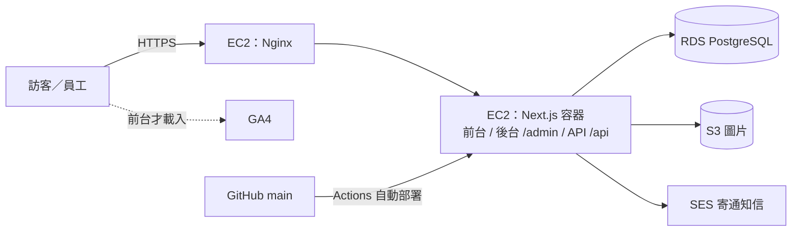

# 技術架構與需求

已拍板的決策（D 編號）見 `docs/decisions.md`。頁面與區塊內容見 `docs/site-architecture.md`。

## 1. 需求

### 功能需求

| # | 需求 | 對應頁面／功能 |
|---|---|---|
| F1 | 前台 10 頁，上線必備 7 頁 | `docs/site-architecture.md` Sitemap |
| F2 | 工程洽詢表單：存進資料庫＋寄 Email 通知負責人 | 聯絡我們 |
| F3 | 協力廠商登記表單（之後） | 協力廠商合作 |
| F4 | 後台登入，分「管理員」與「編輯」兩種權限 | `/admin` |
| F5 | 後台內容管理（新增／修改／刪除／上下架）：工程實績、最新消息、職缺、團隊成員、證照 | `/admin` |
| F6 | 後台公司資料設定：統編、登記證字號、等級、地址、電話等，全站從這裡讀 | `/admin/settings` |
| F7 | 後台表單收件匣：查看洽詢與協力廠商資料，可標記處理狀態 | `/admin/inquiries` |
| F8 | 圖片上傳，後台可管理（先存本機，設定 `STORAGE_DRIVER=s3` 換 S3，D16） | 所有內容 |

### SEO 需求

| # | 需求 |
|---|---|
| S1 | 前台頁面伺服器端產生 HTML（SSG／ISR），內容改了後台存檔就更新 |
| S2 | 每頁獨立 title、description、Open Graph 圖 |
| S3 | `sitemap.xml`、`robots.txt` 自動產生；`/admin`、`/api` 不收錄 |
| S4 | JSON-LD 結構化資料：`GeneralContractor`（公司）、`BreadcrumbList` |
| S5 | `<html lang="zh-TW">`、canonical 網址 |
| S6 | 圖片用 `next/image`，Core Web Vitals 達標 |
| S7 | 上線後登記 Google Search Console 並提交 sitemap |

### GA4 需求

| # | 事件 | 觸發時機 |
|---|---|---|
| G1 | `page_view` | 前台每頁（`/admin` 不裝 GA4） |
| G2 | `generate_lead`（設為主要事件） | 洽詢表單送出成功 |
| G3 | `click_phone` | 點 `tel:` 連結 |
| G4 | `click_email` | 點 `mailto:` 連結 |
| G5 | `cta_click` | 點「工程洽詢」按鈕，帶參數標示是哪個位置 |

隱私權政策要說明分析用 cookie（`docs/content-collection.md` #16）。

### 非功能需求

| # | 需求 |
|---|---|
| N1 | 全站 HTTPS，憑證自動續約 |
| N2 | 表單防垃圾：Cloudflare Turnstile＋同 IP 頻率限制 |
| N3 | 資料庫每日自動備份（RDS 自動備份） |
| N4 | push 到 `main` 自動部署到 EC2 |
| N5 | 網站掛掉自動重啟（Docker restart policy） |
| N6 | 機密（DB 密碼、S3 金鑰、SMTP）只放環境變數，不進 git |

## 2. 技術棧

| 層 | 技術 | 依據 |
|---|---|---|
| 前台＋後台＋API | Next.js 16（App Router），單一專案 | D6、D8 |
| 資料庫 | PostgreSQL，放在 AWS RDS | D6、D9 |
| 圖片儲存 | 本機 `storage/uploads/`（預設）或 AWS S3，`STORAGE_DRIVER` 切換 | D9、D16 |
| 執行環境 | AWS EC2 + Docker | D9 |
| 反向代理＋HTTPS | Nginx + certbot（Let's Encrypt） | D10 |
| ORM | Prisma 7.10（固定穩定版，npm 的 latest 標籤目前指向 8.0 rc） | D11 |
| 後台登入 | 自己寫：argon2id 密碼雜湊＋DB session（cookie 放隨機 token、DB 只存 SHA-256） | D12 |
| 寄信 | AWS SES | D13 |
| CI/CD | GitHub Actions | N4 |
| 分析 | GA4 | D4 |

## 3. 架構圖

## 4. Next.js 目錄

| 路徑 | 用途 |
|---|---|
| `app/(site)/` | 前台頁面（之後裝 GA4、頁首頁尾） |
| `app/admin/` | 後台（`noindex`、不裝 GA4）。`login/` 登入頁；`(panel)/` 需登入的頁面；`_actions/` server actions；`_components/` 後台元件；`admin.css` 後台樣式 |
| `app/api/admin/` | 後台 API：`login`、`logout`、`media`（上傳／列表；不經 proxy，因為圖片上限 10MB） |
| `app/api/health` | 健康檢查 |
| `app/media/[...path]/` | 本機儲存模式下提供上傳的圖片（擋路徑穿越、只回圖片 MIME、長期快取） |
| `app/robots.ts`、`app/sitemap.ts` | S3 |
| `proxy.ts` | 沒有 session cookie 的人擋出 `/admin`（只看 cookie；真正驗證在 `lib/admin/guard.ts`） |
| `lib/admin/` | 後台共用：`guard.ts`（`requireAdmin()`／`requireRole()`）、`session.ts`、`rate-limit.ts`（登入頻率限制，記憶體內）、`validation.ts`（zod） |
| `lib/storage/` | 圖片儲存介面（put／delete／getUrl），`local`、`s3` 兩種實作 |
| `lib/media.ts` | 上傳驗證（JPG／PNG／WebP、10MB、隨機檔名）與圖片引用檢查 |
| `lib/db.ts` | Prisma client（`@prisma/adapter-pg`） |
| `lib/generated/prisma/` | `prisma generate` 產物，不進 git |
| `prisma/schema.prisma` | 資料表定義（第 5 節） |
| `prisma/seed.ts` | 初始資料：公司資料＋第一個管理員（`npm run db:seed`） |
| `storage/uploads/` | 本機儲存模式的圖片，不進 git；Docker 部署要掛 volume |

### 前台網址對照

| 網址 | 頁面（見 `docs/site-architecture.md`） |
|---|---|
| `/` | 首頁 |
| `/about` | 關於我們 |
| `/about/license` | 營造業登記與資格 |
| `/about/team` | 專業團隊 |
| `/about/group` | 集團關係 |
| `/services` | 承攬業務 |
| `/projects`、`/projects/[slug]` | 工程實績列表、單案頁 |
| `/safety-quality` | 工安與品質管理 |
| `/contact` | 聯絡我們／工程洽詢 |
| `/privacy` | 隱私權政策 |
| `/news` | 最新消息 |
| `/careers` | 人才招募 |
| `/partners` | 協力廠商合作 |

每頁目前只有 `<h1>` 佔位，畫面由另外的 AI 設計。

## 5. 資料表

已實作於 `prisma/schema.prisma`（migration `init_admin`）。內容表（projects、news、jobs、team_members、certifications）都有上下架、排序、建立／更新時間；projects 與 news 有唯一 slug；工程實績圖庫另有 `project_images`。

| 表 | 存什麼 | 前台用在哪 |
|---|---|---|
| `company_settings` | 公司名稱、統編、登記證字號、等級、地址、電話、Email（只有一筆） | 頁尾、登記資格、聯絡我們 |
| `admin_users` | 後台帳號、密碼雜湊、角色（管理員／編輯） | — |
| `sessions` | 後台登入 session（D12） | — |
| `projects` | 工程實績：名稱、類別、地點、構造、工期、狀態、上下架 | 工程實績、首頁精選 |
| `media` | 上傳的圖片：儲存路徑、alt、尺寸、大小、MIME（被哪筆內容使用記在內容表的外鍵，被引用時不能刪） | 全站 |
| `team_members` | 姓名、職稱、證照、照片、經歷、是否已取得同意公開 | 專業團隊 |
| `certifications` | 證照名稱、發證單位、有效期限 | 登記資格 |
| `news` | 標題、內文、日期、上下架 | 最新消息 |
| `jobs` | 職缺名稱、地點、條件、上下架 | 人才招募 |
| `inquiries` | 工程洽詢表單內容、處理狀態 | 後台收件匣 |
| `vendor_applications` | 協力廠商表單內容、處理狀態 | 後台收件匣 |

`team_members` 的「已取得同意公開」沒勾就不顯示在前台（對應 `AGENTS.md` 內容鐵則）：後台禁止未同意就上架，前台查詢用 `lib/content.ts` 的 `publicTeamMemberWhere`。

## 6. 環境

| 環境 | 跑在哪 | 資料庫 |
|---|---|---|
| 開發 | 本機 `npm run dev`；PostgreSQL 用 `docker compose`（port 5434，5432／5433 本機已被占用） | 本機 PostgreSQL |
| 正式 | EC2 上跑 `Dockerfile` 建的映像檔（standalone 輸出） | RDS |
