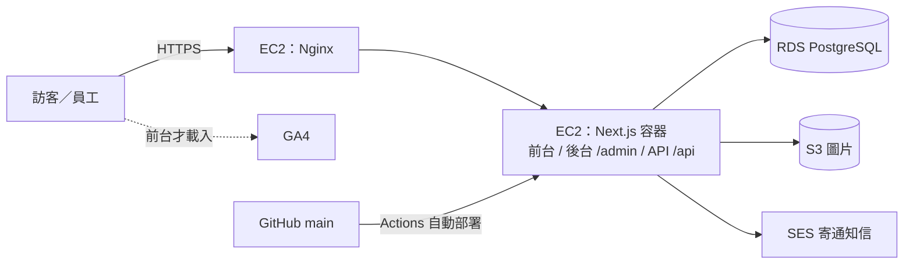

# 技術架構與需求

已拍板的決策編號（D1～D9）見 `docs/decisions.md`。頁面與區塊內容見 `docs/site-architecture.md`。

## 1. 需求

### 功能需求

| # | 需求 | 對應頁面／功能 |
|---|---|---|
| F1 | 前台 10 頁，上線必備 7 頁 | `docs/site-architecture.md` Sitemap |
| F2 | 工程洽詢表單：存進資料庫＋寄 Email 通知負責人 | 聯絡我們 |
| F3 | 協力廠商登記表單（之後） | 協力廠商合作 |
| F4 | 後台登入，分「管理員」與「編輯」兩種權限 | `/admin` |
| F5 | 後台內容管理（新增／修改／刪除／上下架）：工程實績、最新消息、職缺、團隊成員、證照 | `/admin` |
| F6 | 後台公司資料設定：統編、登記證字號、等級、地址、電話等，全站從這裡讀 | `/admin/settings` |
| F7 | 後台表單收件匣：查看洽詢與協力廠商資料，可標記處理狀態 | `/admin/inquiries` |
| F8 | 圖片上傳到 S3，後台可管理 | 所有內容 |

### SEO 需求

| # | 需求 |
|---|---|
| S1 | 前台頁面伺服器端產生 HTML（SSG／ISR），內容改了後台存檔就更新 |
| S2 | 每頁獨立 title、description、Open Graph 圖 |
| S3 | `sitemap.xml`、`robots.txt` 自動產生；`/admin`、`/api` 不收錄 |
| S4 | JSON-LD 結構化資料：`GeneralContractor`（公司）、`BreadcrumbList` |
| S5 | `<html lang="zh-TW">`、canonical 網址 |
| S6 | 圖片用 `next/image`，Core Web Vitals 達標 |
| S7 | 上線後登記 Google Search Console 並提交 sitemap |

### GA4 需求

| # | 事件 | 觸發時機 |
|---|---|---|
| G1 | `page_view` | 前台每頁（`/admin` 不裝 GA4） |
| G2 | `generate_lead`（設為主要事件） | 洽詢表單送出成功 |
| G3 | `click_phone` | 點 `tel:` 連結 |
| G4 | `click_email` | 點 `mailto:` 連結 |
| G5 | `cta_click` | 點「工程洽詢」按鈕，帶參數標示是哪個位置 |

隱私權政策要說明分析用 cookie（`docs/content-collection.md` #16）。

### 非功能需求

| # | 需求 |
|---|---|
| N1 | 全站 HTTPS，憑證自動續約 |
| N2 | 表單防垃圾：Cloudflare Turnstile＋同 IP 頻率限制 |
| N3 | 資料庫每日自動備份（RDS 自動備份） |
| N4 | push 到 `main` 自動部署到 EC2 |
| N5 | 網站掛掉自動重啟（Docker restart policy） |
| N6 | 機密（DB 密碼、S3 金鑰、SMTP）只放環境變數，不進 git |

## 2. 技術棧

| 層 | 技術 | 依據 |
|---|---|---|
| 前台＋後台＋API | Next.js（App Router），單一專案 | D6、D8 |
| 資料庫 | PostgreSQL，放在 AWS RDS | D6、D9 |
| 圖片儲存 | AWS S3 | D9 |
| 執行環境 | AWS EC2 + Docker | D9 |
| 反向代理＋HTTPS | Nginx + certbot（Let's Encrypt） | D10 |
| ORM | Prisma | D11 |
| 後台登入 | 自己寫 session | D12 |
| 寄信 | AWS SES | D13 |
| CI/CD | GitHub Actions | N4 |
| 分析 | GA4 | D4 |

## 3. 架構圖

## 4. Next.js 目錄規劃

| 路徑 | 用途 |
|---|---|
| `app/(site)/` | 前台頁面（裝 GA4、產 SEO metadata） |
| `app/admin/` | 後台頁面（需登入、`noindex`、不裝 GA4） |
| `app/api/` | Route Handlers：表單送出、圖片上傳、後台 CRUD |
| `middleware.ts` | 擋未登入的人進 `/admin` |
| `lib/db/` | 資料庫連線與 schema |
| `lib/seo/` | metadata、JSON-LD 共用函式 |

## 5. 資料表草稿

| 表 | 存什麼 | 前台用在哪 |
|---|---|---|
| `company_settings` | 公司名稱、統編、登記證字號、等級、地址、電話、Email（只有一筆） | 頁尾、登記資格、聯絡我們 |
| `admin_users` | 後台帳號、密碼雜湊、角色（管理員／編輯） | — |
| `sessions` | 後台登入 session（D12） | — |
| `projects` | 工程實績：名稱、類別、地點、構造、工期、狀態、上下架 | 工程實績、首頁精選 |
| `media` | S3 上的圖片：路徑、alt 文字、屬於哪筆資料 | 全站 |
| `team_members` | 姓名、職稱、證照、照片、經歷、是否已取得同意公開 | 專業團隊 |
| `certifications` | 證照名稱、發證單位、有效期限 | 登記資格 |
| `news` | 標題、內文、日期、上下架 | 最新消息 |
| `jobs` | 職缺名稱、地點、條件、上下架 | 人才招募 |
| `inquiries` | 工程洽詢表單內容、處理狀態 | 後台收件匣 |
| `vendor_applications` | 協力廠商表單內容、處理狀態 | 後台收件匣 |

`team_members` 的「已取得同意公開」沒勾就不顯示在前台（對應 `AGENTS.md` 內容鐵則）。

## 6. 環境

| 環境 | 跑在哪 | 資料庫 |
|---|---|---|
| 開發 | 本機 `docker compose`（Next.js + PostgreSQL 容器） | 本機 PostgreSQL |
| 正式 | EC2 | RDS |
